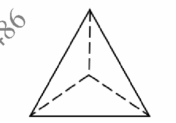
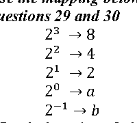
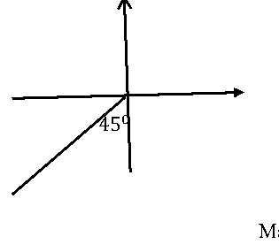
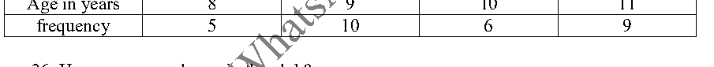
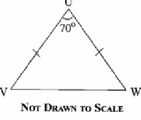

# BECE 2025 Mathematics Import Review

Source PDF: `C:\Users\HP\Downloads\ilide.info-2025-bece-mathematics-questions-serialized-pr_0546f51e8a30ef8d9513ef72d1492645.pdf`

This file is a review source, not a runnable migration. Use it to verify math notation, diagram/table crops, and the answer key before creating the final SQL import.

## Import Defaults

- Exam body: BECE
- Exam year: 2025
- Subject: Mathematics
- Source type: exam_body
- Recommended class: JSS3
- Review status before answer verification: draft

## Extraction Summary

- Objective questions found: 40
- Options per question: 4
- Questions needing math notation review: 23
- Questions needing diagram/table visual review: 5
- Answer key status: missing from PDF; fill `bece_2025_mathematics_answer_key_template.csv` before generating the SQL migration.

## Provisional Answer Review

- Provisional answers have been filled for 38 of 40 questions.
- Questions 7 and 16 have source/options mismatches and are not migration-ready.
- Question 32 has a source diagram split across pages and should be redrawn or carefully combined before migration.
- Final SQL should stay draft-only until these review issues are resolved or explicitly accepted.

## Notation Policy

- Convert stacked fractions, square roots, vectors, and formulas into ``.
- Use safe HTML for simple powers and units, such as `cm2` and `70&deg;`.
- Crop diagrams/tables as PNG files and embed them above the relevant question text.
- Do not trust raw PDF text for final math; visually compare against the PDF page before migration.

## Questions

### Question 1 (PDF page 5; plain text review)

List the members of the set Q = {prime factors of 30}

- A. {2,3,5}
- B. {2,6,10}
- C. {3,5,15}
- D. {3, 6, 10}

Answer: A

### Question 2 (PDF page 5; math review)

Find the place value of 7 in 274,345,685?

- A. 700,000
- B. 7,000,000
- C. 70,000,000
- D. 700,000,000

Answer: C
Review note: normalize math notation to MathQuill span or safe HTML

### Question 3 (PDF page 5; plain text review)

Find the Highest Common Factor of 18, 42 and 90.

- A. 21
- B. 18
- C. 9
- D. 6

Answer: D

### Question 4 (PDF page 5; math review)

Find the value of √6 1 4

- A. 5.0
- B. 4.9
- C. 2.5
- D. 2.4

Answer: C
Review note: normalize math notation to MathQuill span or safe HTML

### Question 5 (PDF page 5; plain text review)

If 𝑝 × 𝑞 × 𝑟 = 1197, 𝑎𝑛𝑑  𝑝 = 19, 𝑞 = 3, 𝑓𝑖𝑛𝑑 𝑟.

- A. 21
- B. 49
- C. 57
- D. 61

Answer: A

### Question 6 (PDF page 5; math review)

How many integers are within the interval −5 < 𝑥 < 7?

- A. 10
- B. 11
- C. 12.
- D. 13.

Answer: B
Review note: normalize math notation to MathQuill span or safe HTML

### Question 7 (PDF page 5; math review)

Simplify 1 3 (2 2 4 + 5 6 )

- A. 13 / 4
- B. 7 / 6
- C. 13 / 18
- D. 31 / 18

Answer: TODO - source/options mismatch
Review note: normalize math notation to MathQuill span or safe HTML
Review note: Source/options mismatch: computed value does not appear in A-D. Keep out of migration until verified.

### Question 8 (PDF page 5; plain text review)

Find the sum of the factors of 72.

- A. 100
- B. 123
- C. 180
- D. 195

Answer: D

### Question 9 (PDF page 5; plain text review)

Simplify 2𝑎𝑏2  × 3𝑎2𝑏

- A. 5𝑎3𝑏3
- B. 5𝑎2𝑏2
- C. 6𝑎3𝑏3
- D. 6𝑎2𝑏2

Answer: C

### Question 10 (PDF page 6; math review)

What is the value of 𝑥 if 10𝑥 = 1000?

- A. 1
- B. 2
- C. 3
- D. 4

Answer: C
Review note: normalize math notation to MathQuill span or safe HTML

### Question 11 (PDF page 6; plain text review)

Subtract 125.47 from 203.90.

- A. 78.57
- B. 78.43
- C. -121.57
- D. -122.38

Answer: B

### Question 12 (PDF page 6; plain text review)

Evaluate 0.00494 0.041

- A. 0.012
- B. 0.12
- C. 1.2
- D. 12.0

Answer: B

### Question 13 (PDF page 6; plain text review)

Remove the brackets 𝑎 − 2(𝑏 − 3𝑐).

- A. 𝑎 − 2𝑏 − 3𝑐
- B. 𝑎 − 2𝑏 − 6𝑏
- C. 𝑎 − 2𝑏 + 6𝑐
- D. 𝑎 − 3𝑏 + 3𝑏

Answer: C

### Question 14 (PDF page 6; math review)

Three baskets contain 95 oranges, 𝑥 oranges 2𝑥 oranges. How many oranges are in the baskets?

- A. 96𝑥
- B. 95 + 3𝑥
- C. 95 + 2𝑥2
- D. 98𝑥

Answer: B
Review note: normalize math notation to MathQuill span or safe HTML

### Question 15 (PDF page 6; plain text review)

If 𝑎2 − 𝑏2=(a + b)( a- b), evaluate 9.322 − 0.682.

- A. 87.32
- B. 86.4
- C. 74.65
- D. 10.0

Answer: B

### Question 16 (PDF page 6; plain text review)

Factorize 𝑎𝑥 +  3𝑥 + 𝑎 + 3

- A. (𝑥 + 5 )( 2𝑦 + 10)
- B. (𝑥 + 2)(𝑦 + 10)
- C. (𝑥 + 5)(𝑦 + 2)
- D. (𝑥 + 2)(𝑦 + 5)

Answer: TODO - source/options mismatch
Review note: Source/options mismatch: factorization appears to have no matching option. Keep out of migration until verified.

### Question 17 (PDF page 6; math review)

If 3 15  is equivalent to 45 𝑎  , find a.

- A. 225
- B. 150
- C. 252
- D. 126

Answer: A
Review note: normalize math notation to MathQuill span or safe HTML

### Question 18 (PDF page 6; plain text review)

Add the following numbers 2.4, 0.042, 1.12 and 0.342

- A. 2.184
- B. 3.904
- C. 4.282
- D. 5.200

Answer: B

### Question 19 (PDF page 6; math review)

Find 12 1 2  % 0𝑓 𝐺𝐻Ȼ80.00.

- A. GHȻ8.00
- B. GHȻ10.00
- C. GHȻ12..50
- D. GHȻ12.00

Answer: B
Review note: normalize math notation to MathQuill span or safe HTML

### Question 20 (PDF page 6; math review, diagram/table review)

What is the name of the figure above?

- A. Cuboid
- B. Kite
- C. Triangle
- D. Pyramid

Answer: D
Review note: normalize math notation to MathQuill span or safe HTML; verify/crop diagram or table from PDF visual page
Review note: Visual asset prepared: assets/bece_2025_mathematics/q20_pyramid.png.

### Question 21 (PDF page 6; math review)

A printing machine print 600 books in 3 hours. How many books will the machine print in 5 hours?

- A. 360 books
- B. 1000 books
- C. 1800 books
- D. 3000 books

Answer: B
Review note: normalize math notation to MathQuill span or safe HTML

### Question 22 (PDF page 6; math review)

A car uses 150 litres of petrol in 45 minutes. How many litres of petrol will it use in 1 hour?

- A. 375 Litres
- B. 230 litres
- C. 225 litres
- D. 200 litres

Answer: D
Review note: normalize math notation to MathQuill span or safe HTML

### Question 23 (PDF page 7; math review)

How many lines of symmetry has an isosceles triangle?

- A. 1
- B. 2
- C. 3
- D. 4

Answer: A
Review note: normalize math notation to MathQuill span or safe HTML

### Question 24 (PDF page 7; plain text review)

The volume of is 27𝑐𝑚3. Find the area of one of its faces.

- A. 3𝑐𝑚2
- B. 6𝑐𝑚2
- C. 9𝑐𝑚2
- D. 18𝑐𝑚2

Answer: C

### Question 25 (PDF page 7; math review)

Which of the following best describes the statement: ‘the locus of a point which moves so that its distance from two fixed point are always equal?

- A. Bisector of an angle
- B. Perpendicular bisector
- C. Circle
- D. Two parallel lines

Answer: B
Review note: normalize math notation to MathQuill span or safe HTML

### Question 26 (PDF page 7; plain text review)

The interior angle of a regular polygon is135𝑜. How many sides has the polygon.

- A. 6
- B. 8
- C. 9
- D. 12

Answer: B

### Question 27 (PDF page 7; plain text review)

If 𝑎 ∗ 𝑏 = 2𝑎 − 𝑏, evaluate 4 ∗ 3.

- A. 1
- B. 2
- C. 4
- D. 5

Answer: D

### Question 28 (PDF page 7; math review, diagram/table review)

Arrange the following numbers in ascending order: 0.5, 3, -5, 0.

- A. 0, 0.5, -5, 3
- B. 0, -5,0.5,3
- C. -5,0, 0.5, 3
- D. -5, 0.5, 0, 3 / Use the mapping below to answer / questions 29 and 30 / 23 → 8 / 22 → 4 / 21 → 2 / 20 → 𝑎 / 2−1 → 𝑏

Answer: C
Review note: normalize math notation to MathQuill span or safe HTML; verify/crop diagram or table from PDF visual page

### Question 29 (PDF page 7; math review)

What is the value of a?

- A. 0
- B. 1 / 2
- C. 1
- D. 2

Answer: C
Review note: normalize math notation to MathQuill span or safe HTML
Review note: Visual asset prepared: assets/bece_2025_mathematics/q29_q30_mapping.png.

### Question 30 (PDF page 7; math review)

What is value of b?

- A. -2
- B. 1 / 2
- C. 1 / 4
- D. 1

Answer: B
Review note: normalize math notation to MathQuill span or safe HTML
Review note: Visual asset prepared: assets/bece_2025_mathematics/q29_q30_mapping.png.

### Question 31 (PDF page 7; math review)

Given the points S (5,-2) and T (3, 2), calculate the gradient of the line ST.

- A. -2
- B. − / 3 / 5
- C. 1 / 2
- D. 2

Answer: A
Review note: normalize math notation to MathQuill span or safe HTML

### Question 32 (PDF page 7; diagram/table review)

The diagram below, calculate the bearing of points X from Y.                                       North                                                  450 X

- A. 0350
- B. 1350
- C. 0450
- D. 2250

Answer: D
Review note: verify/crop diagram or table from PDF visual page
Review note: Visual asset prepared but source label is split across pages: assets/bece_2025_mathematics/q32_bearing.png. Review/redraw before final migration.

### Question 33 (PDF page 8; math review)

IF r = (3 1) and s = (−2 1 ), calculate 6(r +2s).

- A. (−1 / 3 )
- B. (1 / 3)
- C. (7 / 3)
- D. (−6 / 18)

Answer: D
Review note: normalize math notation to MathQuill span or safe HTML

### Question 34 (PDF page 8; math review)

Two sides of a rectangle are 10 cm and 6 cm, calculate the area of a square with the same perimeter as that of the rectangle.

- A. 16𝑐𝑚2
- B. 30𝑐𝑚2
- C. 60𝑐𝑚2
- D. 64𝑐𝑚2

Answer: D
Review note: normalize math notation to MathQuill span or safe HTML

### Question 35 (PDF page 8; math review, diagram/table review)

There are 15 girls in a group. If the ratio of the girls to boys is 3: 2, how many members are in the club?

- A. 6
- B. 10
- C. 22
- D. 25 / The table below gives the ages of members of a juvenile club. Use it to answer questions 36 and 37. / Age in years 8 9 10 11 / frequency 5 10 6 9

Answer: D
Review note: normalize math notation to MathQuill span or safe HTML; verify/crop diagram or table from PDF visual page

### Question 36 (PDF page 8; math review)

How many people are in the club?

- A. 15
- B. 20
- C. 30
- D. 38

Answer: C
Review note: normalize math notation to MathQuill span or safe HTML
Review note: Visual asset prepared: assets/bece_2025_mathematics/q36_q37_table.png.

### Question 37 (PDF page 8; math review)

What is the modal age of the members of the club?

- A. 8 years
- B. 9 years
- C. 10 years
- D. 11 years

Answer: B
Review note: normalize math notation to MathQuill span or safe HTML
Review note: Visual asset prepared: assets/bece_2025_mathematics/q36_q37_table.png.

### Question 38 (PDF page 8; plain text review)

Find the simple interest on GHȻ120,000.00 for 5 months at 12% per annum.

- A. GHȻ6,000.00
- B. GHȻ72,000.00
- C. GHȻ50,000.00
- D. GHȻ72,000.00

Answer: A

### Question 39 (PDF page 9; math review)

If S= {1, 2, 3, 4, 5, 6, 7, 8, 9, 10}, find the probability that a number selected at random from S is odd.

- A. 3 / 8
- B. 1 / 4
- C. 1 / 2
- D. 5 / 8

Answer: C
Review note: normalize math notation to MathQuill span or safe HTML

### Question 40 (PDF page 9; diagram/table review)

In the diagram, UVW is an isosceles triangle, |UV| = |UW| and angle VUW = 70°. Find angle UVW

- A. 70°
- B. 60°
- C. 55°
- D. 35°

Answer: C
Review note: verify/crop diagram or table from PDF visual page
Review note: Visual asset prepared: assets/bece_2025_mathematics/q40_triangle.png.
